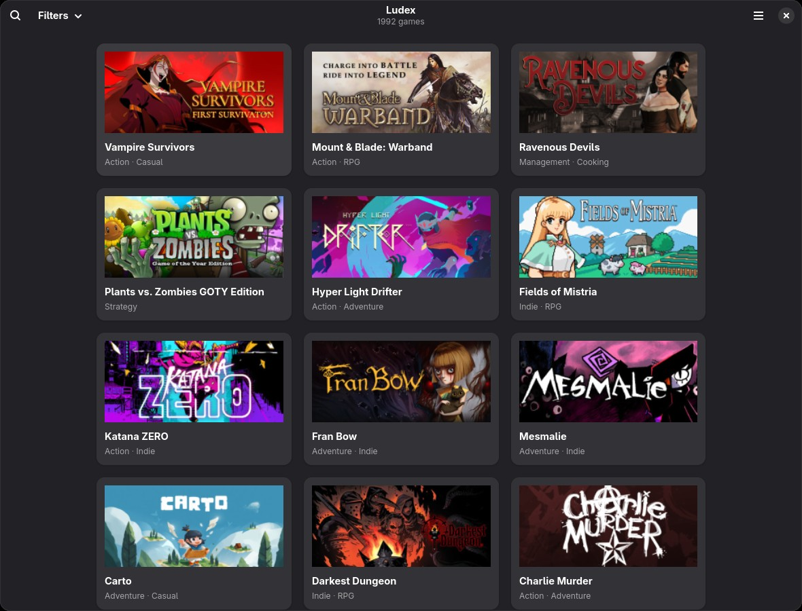
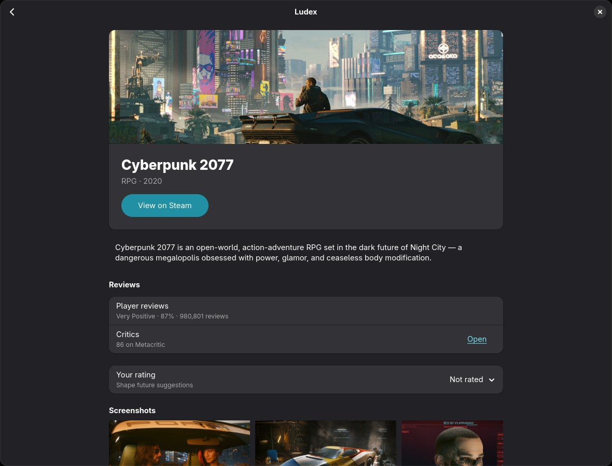
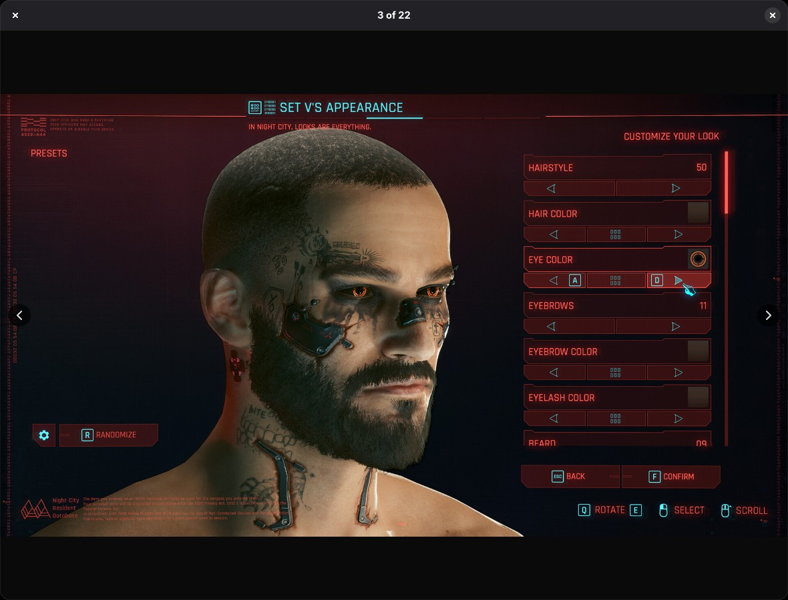

# ludex

**A local-first catalogue and recommender for the games you can actually play on
Linux.** Browse your library in a native GTK4 window, or ask the CLI what to play
next — then see exactly why it said so.



ludex parses a game listing, resolves each entry to a stable identity, and
enriches it from four sources: ProtonDB playability, AreWeAntiCheatYet, Steam
store/review/Deck data, and SteamSpy tags. Everything lands in one
newline-delimited JSON store plus a response cache, so the native window reads it
all offline.

## Why try ludex?

- **It answers "what do I play next?", not "what exists".** A gated, explainable
  recommender scores your catalogue from your own ratings and the tags you like,
  and `why` shows the arithmetic behind every pick.
- **Linux first, not Linux as an afterthought.** ProtonDB tiers, anti-cheat
  status, native vs Wine runtime, and Steam's own SteamOS/Deck verdicts are
  first-class filters.
- **Local-first and honest about absence.** One JSONL store with provenance on
  every fact; missing data stays missing instead of turning into a guess.
- **Offline by default in the window.** `enrich` and `art` do the network work;
  the UI only ever opens local files.
- **Polite bulk fetching.** Requests are paced per source, bounded to four in
  flight, retried with backoff, and cached — a rerun asks for nothing.
- **Native desktop, no browser.** GTK4/libadwaita, built with `nim c`.

## Install

You need [Nim](https://nim-lang.org), [Atlas](https://github.com/nim-lang/atlas)
and, for the window, GTK4 and libadwaita.

```sh
atlas install
atlas pin
nim c -o:bin/ludex src/ludex.nim
nim c -o:bin/ludex-ui src/ludexui/app.nim   # the window
```

## Quick start

```sh
# 1. Parse the game listing into a store.
bin/ludex parse --table tests/fixtures/listing-table.md --out data/releases.jsonl

# 2. Learn what the games are. Start small; every answer is cached.
bin/ludex enrich --store data/releases.jsonl --source steamspy --limit 400
bin/ludex enrich --store data/releases.jsonl --source steam   --limit 20
bin/ludex enrich --store data/releases.jsonl                  --limit 60  # ProtonDB
bin/ludex enrich --store data/releases.jsonl --source anticheat

# 3. Download the artwork the window shows.
bin/ludex art --limit 50

# 4. Browse it, or ask for a recommendation.
bin/ludex-ui
bin/ludex pick --store data/releases.jsonl --limit 10
```

`pick` ranks only what it has evidence about, and says so:

```text
taste     Strategy, Turn-Based Strategy, Sandbox, Turn-Based, Singleplayer, Puzzle
avoids    Crafting, Investigation, Female Protagonist
7 candidates, 7 blocked, 1984 with no data yet
```

## The recommender

Rate a few games and the next pick gets personal. `why` breaks one game's score
down so you can disagree with a factor instead of the black box:

```sh
bin/ludex rate 1264280 loved
bin/ludex rate 729000 bounced
bin/ludex why 1615290 --store data/releases.jsonl
```

```text
Ravenous Devils  [1615290]
  score     79.5% from 95% of the weight known
  quality     93%  92.6% of 9916 reviews, Very Positive, smoothed to 92.5%
  fit         57%  tag similarity 0.15 (Management, Cooking, Villain Protagonist)
  run         95%  ProtonDB platinum over 8 reports
  price       80%  USD 4.99
  popularity  80%  9482 players recommend it
  effort     unknown  no time budget given
```

The weights are plain JSON, tunable without a rebuild:

```sh
bin/ludex weights --out data/weights.json
bin/ludex pick --store data/releases.jsonl --weights data/weights.json
```

## The desktop window



An artwork gallery puts recommendations first, then the rest of the catalogue by
title. Open a game for its Linux compatibility, player reviews, price and
screenshots, then **View on Steam** to take the next step. The viewer shows
screenshots at their own size:



- Search the whole catalogue by title, genre or tag with **Ctrl+F**.
- Go back with **Alt+Left** and keep your search, page and scroll position.
- **Rate Game** on a game's page feeds the recommender; ratings are saved to the
  same file the CLI uses.
- The gallery reflows from one to many columns; pages hold 24 games so artwork
  stays responsive, while search still covers every page.

The window never touches the network: `ludex enrich` supplies metadata and
`ludex art` downloads pictures.

## Command line

| Command | What it does |
|---|---|
| `parse` | Turn a listing table into `releases.jsonl` |
| `enrich` | Fetch playability, anti-cheat, store facts and tags |
| `art` | Download backgrounds, headers and screenshots |
| `list` | Filter the catalogue by runtime, size, language, tier, genre and more |
| `show` | Print one game with everything known about it |
| `rate` | Record loved / played / finished / bounced / skipped / later |
| `pick` | Recommend what to play next |
| `why` | Show every factor behind one score |
| `weights` | Write the tunable ranking weights as JSON |

**See [docs/USAGE.md](docs/USAGE.md) for the full walkthrough, every option and
the on-disk formats.** `bin/ludex help` prints the short version.

## Development

```sh
nim c -r tests/tester.nim                 # also -d:release and -d:danger
```

The suite is deterministic and offline: decoders run against recorded responses
and the ingest tests drive the client from a seeded cache, so no test opens a
socket.

| Path | Role |
|---|---|
| `src/ludexcore/` | pure core: models, parsing, filtering, storage |
| `src/ludexcore/sources/` | one pure decoder per upstream source |
| `src/ludexingest/` | paced, cached HTTP: enrichment and art download |
| `src/ludex.nim` | CLI, which owns the filesystem and the network |
| `src/ludexui/` | native GTK4 window |
| `docs/DESIGN.md` | design, source survey, recommender plan, roadmap |
| `docs/USAGE.md` | full CLI walkthrough and data formats |

`ludexcore` performs no I/O, which is why the suite needs no network. See
`docs/DESIGN.md` for the design, the phase status and the roadmap, and
`AGENTS.md` for contributor conventions.
